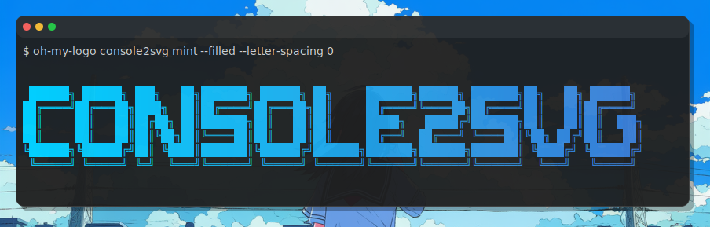
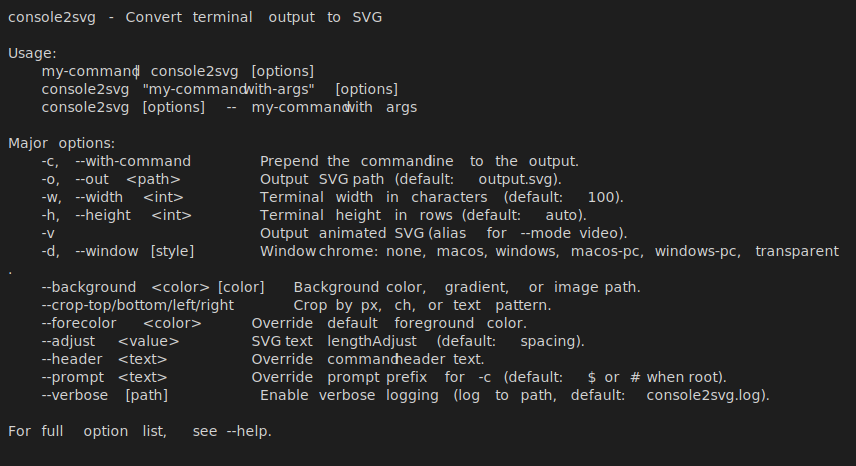
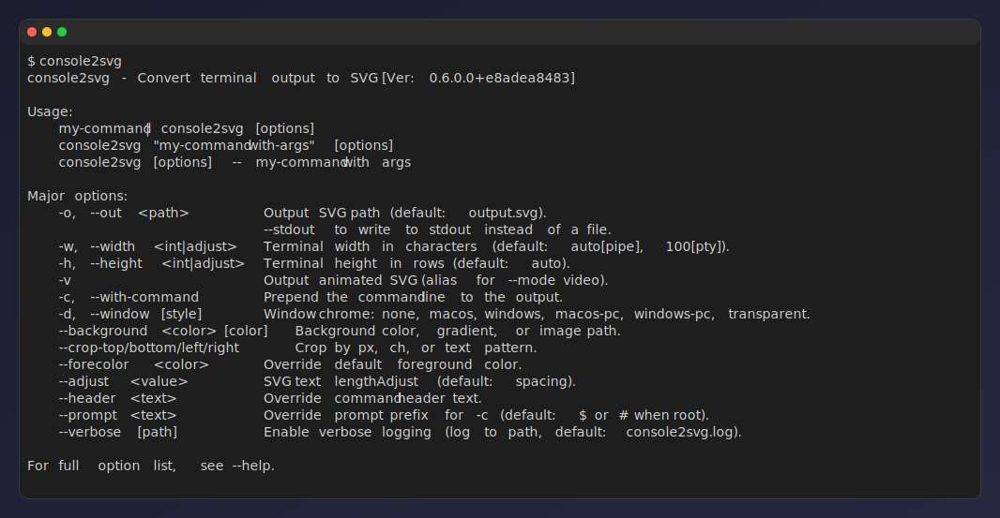
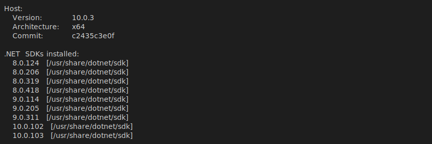
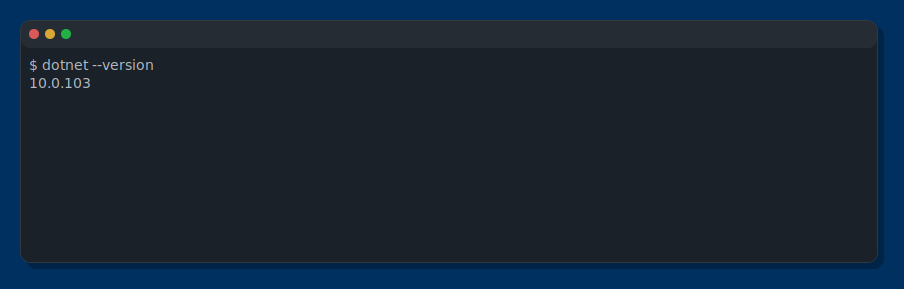
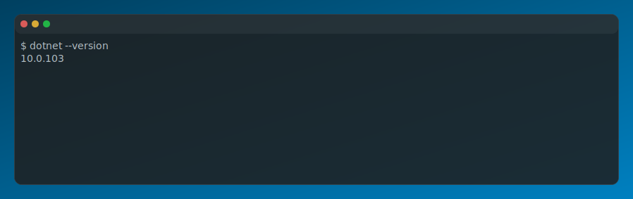

# console2svg
Easily convert terminal output into SVG images. truecolor, animation, cropping and many appearance options are supported.



## Why console2svg?

Console screenshots in raster formats (PNG, etc.) often make text look blurry. console2svg converts console output into vector SVG images so you can save your terminal as a crisp, scalable image.

For example, let's open [this image](https://raw.githubusercontent.com/arika0093/console2svg/refs/heads/main/assets/cmd-hero-grad.svg) in your browser and zoom in — the text remains sharp at any scale 👀

There are similar tools, but console2svg stands out for:

* **No dependencies**: no additional software or libraries required. available as npm, dotnet tool and static binary.
* **Video mode**: save command execution animations as SVG. great for documentation and blog posts.
* **Crop**: trim specific parts of the output. Crop based on text patterns is also supported, making it easy to trim specific lines or sections.
* **Background and window**: add background and window frames to produce presentation-ready SVGs for documentation, blogs, social media, etc.
* **CI friendly**: With features like replay and timeout, it can generate both static and animated SVGs in CI environments, minimizing discrepancies between code and images.
* **Windows support**: works on Windows, macOS and Linux.

## Overview

The simplest way to use it is to just put the command you want to run after `console2svg`. For example, the following command converts the description text of `console2svg` into SVG (oh, how meta).

```bash
console2svg console2svg

```



You can also generate SVG with a window frame. and some options to customize the appearance.  
For example, `-w` specifies the width, `-c` is an option to display the command at the beginning of the output, and `-d` is an option to specify the style of the window frame, where we specify a macOS-like frame. If the command is long, you can also write it together after `--`.

```bash
console2svg -w 120 -c -d macos-pc -- console2svg
```



---

In video mode(`-v`), you can capture the animation of the command execution and save it as an SVG.
By using the [replay feature](#replay-input), you can save the command execution record and later regenerate the SVG based on that record.

```bash
console2svg -v -c -d macos -- copilot --banner
```



## Install
[](https://www.nuget.org/packages/ConsoleToSvg/) [](https://www.npmjs.com/package/console2svg) [](https://github.com/arika0093/console2svg/releases/latest)
 

You can install it as a global tool using the dotnet or npm package manager.

```sh
# dotnet global tool
dotnet tool install -g ConsoleToSvg
# npm global package
npm install -g console2svg
```

It is also available as a standalone binary that you can download from the releases page and add to your PATH.

```sh
# linux
curl -sSL https://github.com/arika0093/console2svg/releases/latest/download/console2svg-linux-x64 -o console2svg
mv -f console2svg /usr/local/bin/
chmod +x /usr/local/bin/console2svg

# windows (cmd)
curl -sSL https://github.com/arika0093/console2svg/releases/latest/download/console2svg-win-x64.exe -o console2svg.exe
```

## Usage
### Pipe mode

Width and height default to the current terminal dimensions.

```sh
my-command | console2svg
```

### PTY command mode

Width is 100 characters by default, and height is automatically adjusted to fit the content.

```sh
console2svg "git log --oneline"
# or 
console2svg -- git log --oneline
```

If you want to set a fixed width and height, you can use the `-w` and `-h` options.

```sh
console2svg -w 120 -h 20 -- git log --oneline
```

### Static SVG with crop

You can crop the output by specifying the number of pixels or characters to crop from each side.

```sh
# ch: character width, px: pixel
console2svg --crop-top 1ch --crop-left 5px --crop-right 30px -- your-command
```

You can also crop at the position where a specific character appears.
When specifying a character, you can specify it like `:(number)`, which crops at a relative position from the detected line.

For example, the following example crops from the line where the character `Host` is located to 2 lines above the line where the character `.NET runtimes installed:` is located.

```sh
console2svg --crop-top "Host" --crop-bottom ".NET runtimes installed:-2" -- dotnet --info
```

The result will look like this.




### Background and opacity

You can set the background color or image of the output SVG, and adjust the opacity of the background fill.

```sh
console2svg -h 10 -c -d macos-pc --background "#003060" --opacity 0.8 -- dotnet --version
```



You can also set a gradient background.

```sh
console2svg -h 10 -c -d macos-pc --background "#004060" "#0080c0" --opacity 0.8 -- dotnet --version
```



Image background is also supported.

```sh
console2svg -h 10 -c -d macos-pc --background image.png --opacity 0.8  -- dotnet --version
```


### Animated SVG

use `-m video` or `-v` to capture the animation of the command execution and save it as an SVG.

```sh
# apt install sl
console2svg -c -d -v -- sl
```



You can specify the `--timeout` option to output SVG after a certain time has elapsed.
This is useful for converting commands that do not terminate, such as `nyancat`, into SVG.

There is also a `--sleep` option to specify the stop time after playback. This allows you to display the last frame for a specified time after the command execution is finished (2 seconds by default).

```sh
# apt install nyancat
console2svg -w 120 -h 28 -c -d -v --timeout 3 --sleep 0 -- nyancat
```



### Replay input
You can also save the command execution record and later regenerate the SVG based on that record. 
To save the record, use the `--replay-save` option to save the command execution.

```sh
console2svg --replay-save ./replay.json -- bash
# save key inputs to replay.json
```

Then, generate the SVG based on the saved key input.
By using this feature, you can generate an SVG that records terminal operations as shown below.

```sh
console2svg -v -c -d macos --replay ./replay.json -- bash
```




The replay file is in a simple JSON format. If you make a mistake in the input, you can directly edit this file (or of course, you can ask AI to fix it for you).

<details>
<summary>Replay file format</summary>

```jsonc
// replay.json
{
  "version": "1",
  "appVersion": "0.4.0.2+17cc95284e",
  "createdAt": "2026-03-01T06:52:43.3615812+00:00",
  // If more than 1 second has passed from the total time,
  // it will exit with an error as a timeout.
  "totalDuration": 10.9530099,
  "replay": [
    {
      // first event: absolute time from recording start (seconds)
      "time": 1.5,
      "key": "e",
      "modifiers": [],
      "type": "keydown"
    },
    {
      // subsequent events: delta from the previous event (seconds)
      "tick": 0.08,
      "key": "c",
      "modifiers": ["shift"],
      "type": "keydown"
    },
    // and so on...
  ]
}
```

</details>

## Options
### Major options

* `-o`: Output SVG file path (default: `output.svg`)
* `-c`: Prepend the command line to the output as if typed in a terminal.
* `-w`: width of the output SVG (default: terminal width[pipe], 80ch[pty])
* `-h`: height of the output SVG (default: terminal height[pipe], auto[pty])
* `-v`: output to video mode SVG (animated, looped by default)
* `-d`: window chrome style (none, macos, ...)
* `--background`: background color or image for the output SVG
* `--verbose`: enable verbose logging
* `--crop-*`: crop the output by specified pixels, characters, or text patterns

### Window chrome

`-d` option allows you to specify the style of the window frame. 

* `none`: no window frame (default)
* `macos`: macOS style window frame (default if `-d` is specified without a value)
* `macos-pc`: macOS style window frame with background and shadow
* `windows`: Windows style window frame
* `windows-pc`: Windows style window frame with background and shadow
