# ConsoleToSvg

`console2svg` is a .NET global tool that converts terminal output into SVG.

## Overview


```bash
console2svg | console2svg
```

This image is generated by converting the description text of this library into SVG (oh, how meta).

---


```bash
console2svg | console2svg --window macos -w 100 -h 24 --padding 5
```

You can also generate SVG with a window frame. and some options to customize the appearance.

---



```bash
console2svg -m video --window macos -w 120 -h 16 -- ./my-install.sh
```

You can also capture the output of a command that runs for a while, and generate an animated SVG that replays the output.

## Install

```sh
dotnet tool install -g ConsoleToSvg
```

## Usage

### Pipe mode

Width and height default to the current terminal dimensions (via `Console.WindowWidth`/`Console.WindowHeight`).

```sh
my-command | console2svg
```

### PTY command mode

```sh
console2svg "git log --oneline"
```

Or pass the command after `--`:

```sh
console2svg -- dotnet test.cs
```

### Animated SVG

```sh
console2svg -m video -- dotnet build
```

Loop playback:

```sh
console2svg -m video --loop -- nyancat
```

### Static SVG with crop

```sh
# ch: charactor width, px: pixel
console2svg "dotnet --info" --crop-top 1ch --crop-right 5px
```

You can also crop at the position where a specific character appears.

```sh
console2svg "dotnet --info" --crop-top "Host:" --crop-bottom "Commit: "
```

### Window chrome and padding

```sh
console2svg --window macos --padding 8 -- dotnet --version
```

## Key options

- `-m, --mode image|video`
- `-c, --command <cmd>` (also works as a bare positional argument)
- `--in <cast-path>`
- `-o, --out <svg-path>`
- `-w, --width <columns>` / `-h, --height <rows>` (default: auto-detected from terminal in pipe mode, 80×24 for PTY)
- `--frame <index>`
- `--crop-top|--crop-right|--crop-bottom|--crop-left <px|ch|pattern>`
- `--theme dark|light`
- `--window none|macos|windows`
- `--padding <px>` (default: 2)
- `--loop` (video mode only, default: false)
- `--font <css-font-family>`
- `--save-cast <path>`
- `--help`
- `--version`
