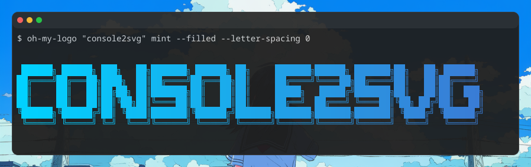
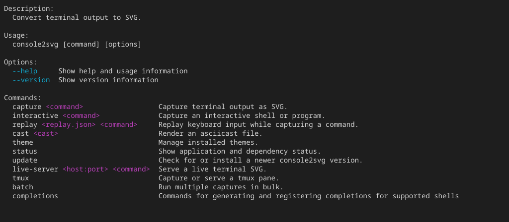
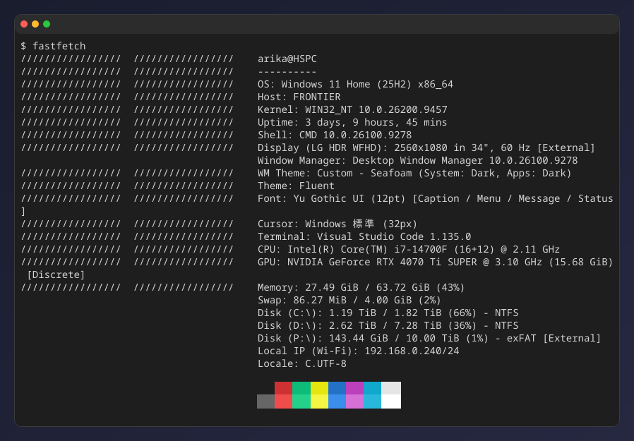
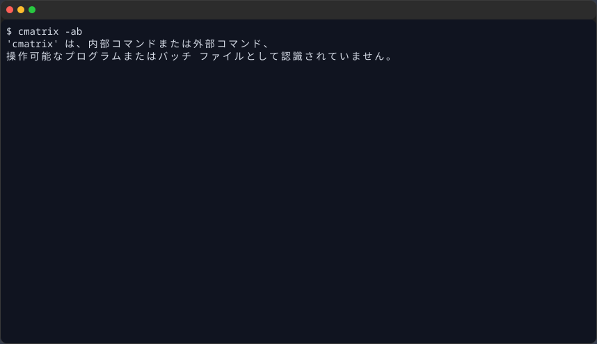
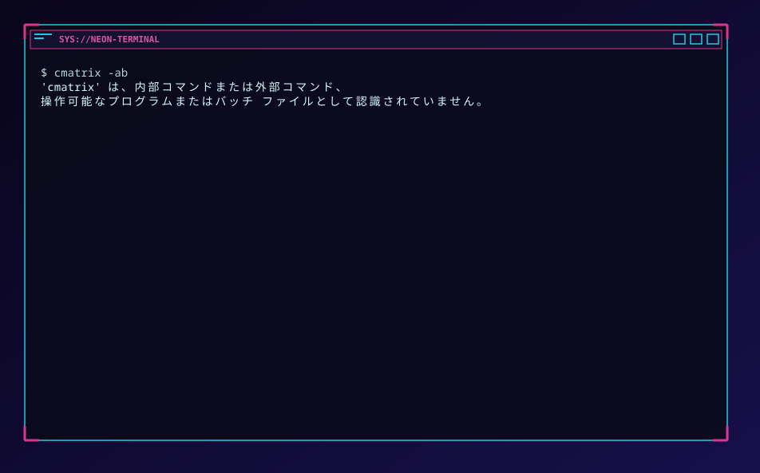
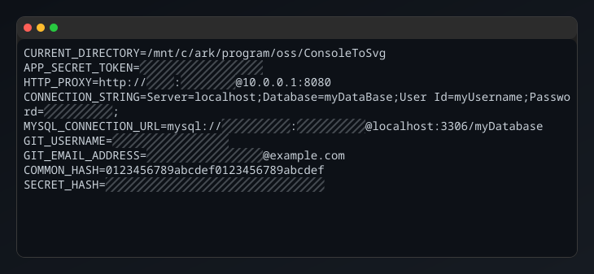

<div align="center">

<!-- c2s:: -w 100 -h 10 -c -d macos-pc --background "assets/image1.png" --opacity 0.95 -- oh-my-logo "console2svg" mint --filled --letter-spacing 0 -->


*Share your terminal beautifully.*

</div>

## Why console2svg?

Convert terminal output into images for READMEs, blog posts, assignments, and documentation.

There are lots of features. You are sure to find something you like:

- **Generate beautiful SVG images** — Render ANSI and Truecolor output as SVG. It delivers high resolution that is perfect for your documentation.
- **Generate videos too** — Share `cmatrix` output in one shot.
- **Automation support** — Regenerate documentation images in CI, with replay support included.
- **Convert to other formats** — Convert to PNG, GIF, WebM, MP4, and more with built-in support.
- **Interactive capture** — Press `F9`/`F10` to capture at any time without launching a screenshot tool.
- **Live Server** — Convert terminal sessions to SVG in real time and show them live in a browser. Even YouTube streaming is possible.
- **Rich custom-theme support** — Choose from a wide variety of themes and customize the terminal appearance to match your preferences.
- **Windows support** — It works on Linux, macOS, and Windows.
- **Built-in crop feature** — Automatically trim overly long output and extract only the parts you need.
- **Share safely** — Common passwords and usernames are masked automatically, even when `APP_SECRET_TOKEN` accidentally appears in the output.

For more information, see the [documentation site](https://console2svg.eclairs.cc).

## Overview

Rather than explaining the features at length in text, here are some real usage examples.

### The simplest example

Capture the command's own help text:

```bash
console2svg capture -- console2svg
```

<!-- c2s:: -w 120 -- console2svg -->


### With a frame

Use a macOS Terminal-style frame, specify the width, and include the executed command name:

```bash
console2svg capture -w 100 -c -d macos-pc -- fastfetch
```

<!-- c2s:: -w 100 -c -d macos-pc -- fastfetch -->


### Background and transparency settings

You can make the output quite stylish with a background image and opacity:

```bash
console2svg capture -w 100 -h 10 -c -d macos-pc \
    --background "assets/image1.png" --opacity 0.95 \
    -- oh-my-logo "console2svg" mint --filled --letter-spacing 0
```

<!-- c2s:: -w 100 -h 10 -c -d macos-pc --background "assets/image1.png" --opacity 0.95 -- oh-my-logo "console2svg" mint --filled --letter-spacing 0 -->


### Animation

#### `sl`

```sh
console2svg capture -c -d -v -- sl
```

<!-- c2s:: -w 120 -h 16 -c -d -v -- sl -->


#### `cmatrix`

```sh
console2svg capture -w 100 -h 24 -c -d macos-pc -v --timeout 5 -- cmatrix -ab
```

<!-- c2s:: -w 100 -h 24 -c -d macos-pc -v --timeout 5 -- cmatrix -ab -->


#### `nyancat`

```sh
console2svg capture -w 160 -h 28 -c -d -v --timeout 5 --sleep 0.5 -- nyancat
```

<!-- c2s:: -w 160 -h 28 -c -d -v --timeout 5 --sleep 0.5 -- nyancat -->


### Replay playback

Replay a file prepared in advance to reproduce the same output in CI environments:

```sh
console2svg replay ./replay.json -w 80 -h 20 -v -c -d macos -- bash
```


### Interactive capture

Start recording with the `F9` key, then press `F9` again to stop recording.

```bash
console2svg interactive -d macos
```


### Theme support

Specify any theme you like, whether built-in or custom.

```bash
console2svg capture -w 100 -h 24 -c -d macos -t nord --timeout 2 -- cmatrix -ab
```

<!-- c2s:: -w 100 -h 24 -c -d macos -t nord --timeout 2 -- cmatrix -ab -->


```bash
console2svg capture -w 100 -h 24 -c -t cyberpunk-pc --timeout 2 -- cmatrix -ab
```

<!-- c2s:: -w 100 -h 24 -c -t cyberpunk-pc --timeout 2 -- cmatrix -ab -->


### Sensitive information masking

Common secrets are masked automatically when capturing terminal output.

<!-- c2s:: -w 80 -h 14 -d macos-pc -t github-dark -- cat .env -->


## Install

### Linux/macOS

The easiest way is the install script.

```sh
curl -sSL https://raw.githubusercontent.com/arika0093/console2svg/main/install.sh | bash
```

### Windows

The easiest way is to use `winget`.

```powershell
# Windows Package Manager (WinGet)
winget install arika0093.console2svg
```

For other installation methods, see [Installation](https://console2svg.eclairs.cc/en/getting-started/installation/).

## License

This project is licensed under the `Apache 2.0` license.

```
Copyright 2026 arika0093

Licensed under the Apache License, Version 2.0 (the "License");
you may not use this file except in compliance with the License.
You may obtain a copy of the License at

http://www.apache.org/licenses/LICENSE-2.0
```

See the [licenses of related projects](https://console2svg.eclairs.cc/en/deep-dive/overview/#minimize-package-dependencies).
