<div align="center">

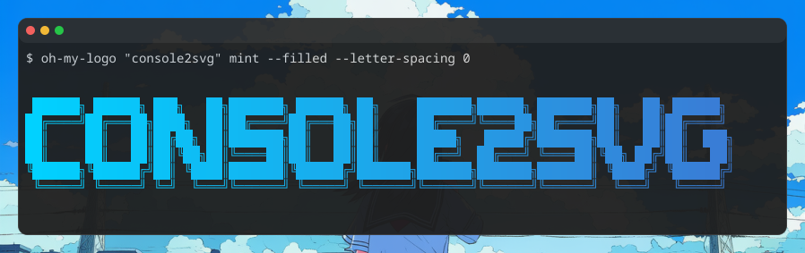

[](https://www.nuget.org/packages/ConsoleToSvg/) [](https://www.npmjs.com/package/console2svg) [](https://github.com/arika0093/console2svg/releases/latest)

Easily convert terminal output into SVG images. <br/>
Truecolor, animation, cropping and many appearance options are supported.

> Of course, this hero image is [generated](https://github.com/arika0093/console2svg/blob/main/scripts/image-gen.sh#L2-L3) using console2svg itself.

</div>

# console2svg

* [Why console2svg?](#why-console2svg)
* [Overview](#overview)
* [Install](#install)
* [Usage](#usage)
* [Appearance options](#appearance-options)

## Why console2svg?
Console screenshots in raster formats (PNG, etc.) often make text look blurry. console2svg converts console output into vector SVG images so you can save your terminal as a crisp, scalable image.

For example, let's open [this image](https://raw.githubusercontent.com/arika0093/console2svg/refs/heads/main/assets/cmd-btop.svg) in your browser and zoom in — the text remains sharp at any scale 👀

There are similar tools, but console2svg stands out for:

* [**No dependencies**](#install): no additional software or libraries required. Everything you need is included.
* [**Video mode**](#animated-svg): save command execution animations as SVG. great for documentation and blog posts.
* [**Interactive capture**](#interactive-capture): capture the current terminal screen on demand, or record a session and save it as an animated SVG.
* [**Crop**](#static-svg-with-crop): trim specific parts of the output. Crop based on text patterns is also supported, making it easy to trim specific lines or sections.
* [**Background and window**](#window-chrome): add background and window frames to produce presentation-ready SVGs for documentation, blogs, social media, etc.
* [**CI friendly**](#github-actions): with features like replay and timeout, it can generate both static and animated SVGs in CI environments, minimizing discrepancies between code and images.
* [**Windows support**](#supported-platforms): works on Windows, macOS and Linux.
* [**Support many format**](#convert-to-other-formats): By incorporating `ffmpeg` and `resvg`, it can output not only SVG but also various formats such as PNG, MP4, GIF, etc.

## Overview

The simplest way to use it is to just put the command you want to run after `console2svg`. For example, the following command converts the description text of `console2svg` into SVG (oh, how meta).

```bash
console2svg console2svg
```

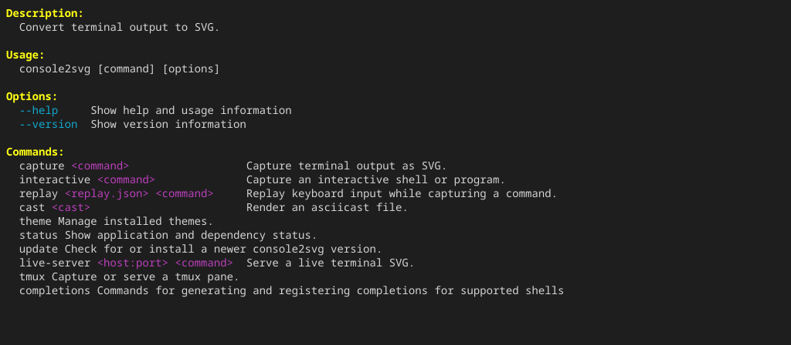

You can also generate SVG with a window frame. and some options to customize the appearance.  
For example, `-w` specifies the width, `-c` is an option to display the command at the beginning of the output, and `-d` is an option to specify the style of the window frame, where we specify a macOS-like frame. If the command is long, you can also write it together after `--`.

```bash
console2svg -w 120 -c -d macos-pc -- console2svg
```

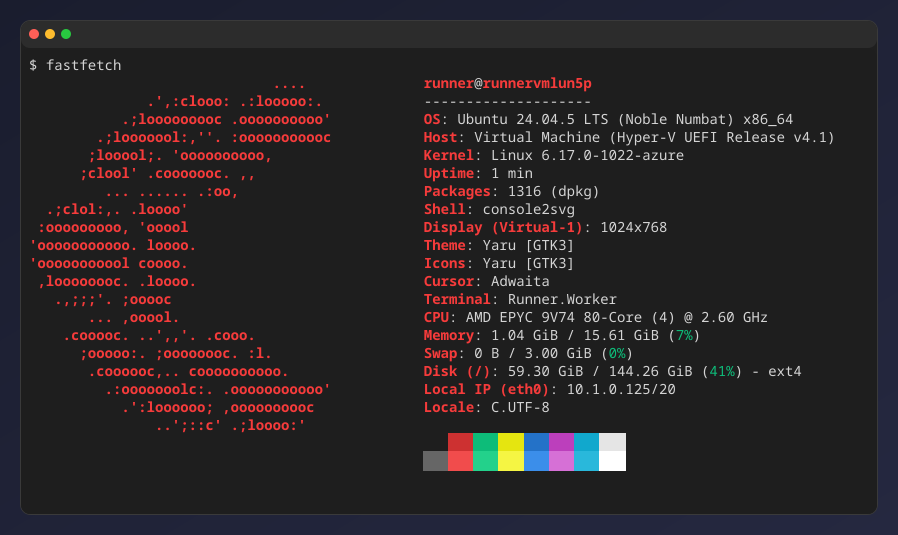

---

In video mode(`-v`), you can capture the animation of the command execution and save it as an SVG.
By using the [replay feature](#replay-input), you can save the command execution record and later regenerate the SVG based on that record.

```bash
console2svg -w 150 -h 32 -v -c -d macos-pc --timeout 7 -- btop -u 200
```



---

In interactive mode(`-i`), you can run your normal interactive shell in a PTY and capture its current screen on demand. Press `F10` to write a static SVG, or `F9` to start recording from the exact current terminal state.

```bash
console2svg -i -d macos -o ./captures/output.svg
# -> saves ./captures/output_yyyyMMdd_HHmmss.svg
```




## Install

The easiest way is the install script.

```sh
# Linux / macOS
curl -sSL https://raw.githubusercontent.com/arika0093/console2svg/main/install.sh | bash

# Windows (PowerShell)
irm https://raw.githubusercontent.com/arika0093/console2svg/main/install.ps1 | iex
```

You can also install via package managers.

```sh
# dotnet global tool (downloads the platform-native binary on first run)
dotnet tool install -g ConsoleToSvg

# npm global package (Windows / Linux / macOS)
npm install -g console2svg
```

You can also install from the [release archives](https://github.com/arika0093/console2svg/releases/latest) manually, or use the `.deb` / `.rpm` packages on Linux.

```sh
# ubuntu
curl -sSL https://github.com/arika0093/console2svg/releases/latest/download/console2svg.amd64.deb -o console2svg.deb
dpkg -i console2svg.deb

# Linux
curl -sSL https://github.com/arika0093/console2svg/releases/latest/download/console2svg.linux-x64.tar.gz -o console2svg.tar.gz
tar -xzf console2svg.tar.gz
chmod +x console2svg
```

### GitHub Actions

A convenient GitHub Action is also available for use in CI. To use the latest version of `console2svg`, simply add the following step to your workflow:

```yaml
- uses: arika0093/console2svg@main
```

<details>
<summary>Example usage in GitHub Actions</summary>

Full workflow example that generates an SVG and commits it back:

```yaml
jobs:
  gen:
    runs-on: ubuntu-latest
    permissions:
      contents: write
    steps:
      - name: Checkout
        uses: actions/checkout@v4

      - name: Setup console2svg
        uses: arika0093/console2svg@main

      - name: Generate SVG
        run: console2svg -w 120 -c -d macos-pc -o output.svg -- dotnet --version

      - name: Commit Changes
        uses: stefanzweifel/git-auto-commit-action@v7
        with:
          commit_message: "[skip-ci] chore: regenerate SVG"
```

</details>

<details>
<summary>CI environment variables override</summary>

Some libraries (for example [chalk](https://www.npmjs.com/package/chalk)) detect CI environments and automatically disable color output. However, when generating SVGs you always want color enabled. Therefore, console2svg automatically sets and removes the following environment variables by default:
* `TERM=xterm-256color`: set to enable color support.
* `COLORTERM=truecolor`: enable TrueColor output.
* `FORCE_COLOR=3`: same; `3` indicates TrueColor.
* `CI` (deleted): removed because some libraries disable color when they detect a CI environment.
* `TF_BUILD` (deleted): removed for the same reason (used by Azure Pipelines).

To disable this behavior, use the `--no-colorenv` and `--no-delete-envs` options.

</details>

> [!TIP]
> This repository uses this action itself to automatically regenerate all the SVG images in the [`assets/`](assets/) directory whenever a new release is published.

## Usage
### Pipe mode

```sh
my-command | console2svg
```

### PTY command mode

```sh
console2svg "git log --oneline"
# or 
console2svg -- git log --oneline
```

If you want to set a fixed width and height, you can use the `-w` and `-h` options.

```sh
console2svg -w 120 -h 20 -- git log --oneline
```

### Interactive capture

Run your normal interactive shell in a PTY and capture its current screen on demand.
On Unix, `console2svg` uses `$SHELL`; on Windows, it uses the system command shell.
The shell's output is forwarded live to your terminal. Press `F10` to write a
static SVG; the capture notification is printed by the host and is not sent to the shell.

```sh
console2svg -i -o ./captures/output.svg
# -> writes ./captures/output_yyyyMMdd_HHmmss.svg (image)
```

Press `F9` to start recording from the exact current terminal state, `F12` to pause or resume it, then `F9` again to save the recording. Output and elapsed time while paused are excluded from the recording.
The output format controls whether the capture is written as animated SVG or converted to the requested video format.

```sh
console2svg -i -o ./captures/session.svg
# -> writes ./captures/session_yyyyMMdd_HHmmss.svg (animation)
```

### Static SVG with crop

You can crop the output by specifying the number of pixels or characters to crop from each side.

```sh
# ch: character width, px: pixel
console2svg --crop-top 1ch --crop-left 5px --crop-right 30px -- your-command
```

You can also crop at the position where a specific character appears.
When specifying a character, you can specify it like `:(number)`, which crops at a relative position from the detected line.

For example, the following example crops from the line where the character `Host` is located to 2 lines above the line where the character `.NET runtimes installed:` is located.

```sh
console2svg --crop-top "Host" --crop-bottom ".NET runtimes installed:-2" -- dotnet --info
```

The result will look like this.

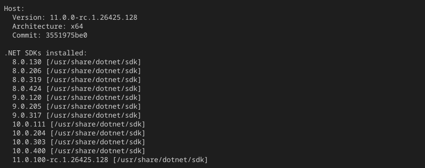

### Animated SVG

use `-m video` or `-v` to capture the animation of the command execution and save it as an SVG.

```sh
# apt install sl
console2svg -c -d -v -- sl
```



You can specify the `--timeout` option to output SVG after a certain time has elapsed.
This is useful for converting commands that do not terminate, such as `nyancat`, into SVG.

There is also a `--sleep` option to specify the stop time after playback. This allows you to display the last frame for a specified time after the command execution is finished.

```sh
# apt install nyancat
console2svg -w 160 -h 32 -c -d -v --timeout 5 --sleep 0.5 -- nyancat -d 10
```



You can also write sequential SVG files starting with `frame-0000.svg` to a specific folder.
This is useful for cherry-picking your favorite frames or converting them into a video using software like ffmpeg. 

```sh
# Install `cmatrix` with your platform's package manager (e.g. apt, brew, winget).
console2svg -c -d -v --timeout 5 --fps 30 --save-frames ./frames-dir -- cmatrix -ab
```

### Replay input
You can also save the command execution record and later regenerate the SVG based on that record. 
To save the record, use the `--replay-save` option to save the command execution.

```sh
console2svg --replay-save ./replay.json -- bash
# save key inputs to replay.json
```

Then, generate the SVG based on the saved key input.
By using this feature, you can generate an SVG that records terminal operations as shown below.

```sh
console2svg -w 80 -h 20 -v -c -d macos --replay ./replay.json -- bash
```


The replay file is in a simple JSON format. If you make a mistake in the input, you can directly edit this file (or of course, you can ask AI to fix it for you).

<details>
<summary>Replay file format</summary>

```json5
// replay.json
{
  "version": "1",
  "appVersion": "0.4.0.2+17cc95284e",
  "createdAt": "2026-03-01T06:52:43.3615812+00:00",
  // If more than 1 second has passed from the total time,
  // it will exit with an error as a timeout.
  "totalDuration": 10.9530099,
  "replay": [
    {
      // first event: absolute time from recording start (seconds)
      "time": 1.5,
      "key": "e",
      "modifiers": [],
      "type": "keydown"
    },
    {
      // subsequent events: delta from the previous event (seconds)
      "tick": 0.08,
      "key": "c",
      "modifiers": ["shift"],
      "type": "keydown"
    },
    // and so on...
  ]
}
```

</details>

### Convert to other formats

In v0.8 and later, you can specify the output format based on the file extension specified with `-o output.mp4`.

First, install `ffmpeg`. Release archives on Windows already include it. On Linux,
install it with your distribution's package manager; on macOS, use Homebrew:

```bash
# ubuntu
sudo apt install ffmpeg
# macos
brew install ffmpeg
# windows
# > ffmpeg is included in console2svg-win-x64.zip
```

Then, you can specify the output file with the desired extension. For example, to convert an animated command to any format, you can use the following command:

```bash
# Install `cmatrix` with your platform's package manager (e.g. apt, brew, winget).
console2svg -o ./output.gif -w 100 -h 24 -v -c -d macos-pc --timeout 5 --fps 30 -- cmatrix -ab
```


You can also output as MP4, WebM, or a static PNG/JPG by changing the extension.

## Appearance options
### Background and opacity

You can set the background color or image of the output SVG, and adjust the opacity of the background fill.

```sh
console2svg -h 10 -c -d macos-pc --background "#003060" --opacity 0.85 -- dotnet --version
```

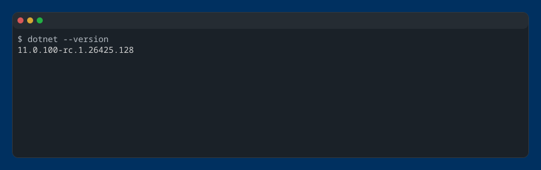

You can also set a gradient background.

```sh
console2svg -h 10 -c -d macos-pc --background "#004060" "#0080c0" --opacity 0.85 -- dotnet --version
```

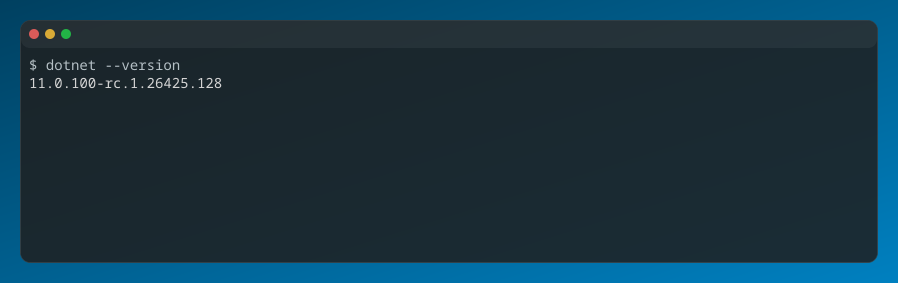

Image background is also supported.

```sh
console2svg -h 10 -c -d macos-pc --background image.png --opacity 0.85  -- dotnet --version
```

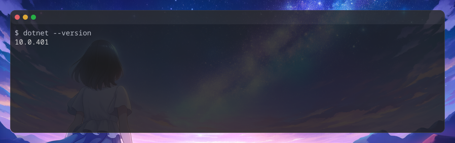

### Terminal Appearance

You can customize the appearance with various options. 
For example, in the following example, the prompt (the string displayed at the beginning) is changed to `[HELLO!] $`,
the command header is changed to `my-custom-header`, and the text color is changed to `#00f040`.

```sh
console2svg -h 4 --prompt "[HELLO!] $" --header "my-custom-header" --forecolor "#00f040" --backcolor "#042515" -- echo "hi"
```

![console2svg -h 4 --prompt "[HELLO!] $" --header "my-custom-header" --forecolor "#00f040" --backcolor "#042515" -- echo "hi"](./assets/cmd-term-custom.svg)


### Window chrome

`-d` option allows you to specify the style of the window frame. 

| Image                                                                      | Style(`-d`)   | Description |
|----------------------------------------------------------------------------|---------------|----|
|                 | `none`        | no window frame |
| 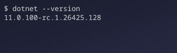  | `transparent` | transparent background (text-only output) |
| 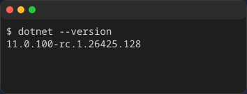              | `macos`       | macOS style window frame |
| 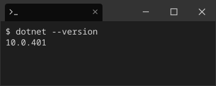          | `windows`     | Windows Terminal style window frame |


`*-pc` styles are designed for use with a background, and include padding and shadows to create a "window" effect. You can also customize the padding with the `--pc-padding` option.

| Image                                                                      | Style(`-d`)   |
|----------------------------------------------------------------------------|---------------|
| 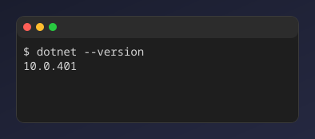        | `macos-pc`    |
| 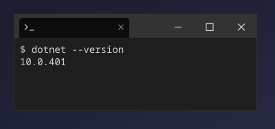    | `windows-pc`  |

## Tips
### Using with `tmux`
By combining with `tmux`, you can save the step-by-step execution process of commands as SVG images.

First, open tmux. If it's not installed, install it using `apt install tmux` or `brew install tmux`, etc.

```sh
tmux
```

Execute commands in the default window (`:0`).

```bash
$ echo "say hello"
$ echo "say goodbye"
```

After completing the command execution you want to record, open a new window with `ctrl+b c`. Then, run `tmux capture-pane | console2svg` to save the content of the original window as SVG.

```sh
# tmux options:
#   -p: print the captured content to stdout
#   -e: include escape sequences (for colors, etc.)
#   -t :0: target the first pane (you can specify other panes as needed)
# console2svg options:
#   -h 12: set the height of the output SVG to 12 lines (adjust as needed)
tmux capture-pane -pe -t :0 | console2svg -h 12 -o capture-$(date +%s).svg
```

<details>
<summary>Recording and replaying tmux usage</summary>

With the power of `console2svg`, you can even record and explain how to use `console2svg` itself :)


</details>

<details>
<summary>tmux capture-pane result example</summary>

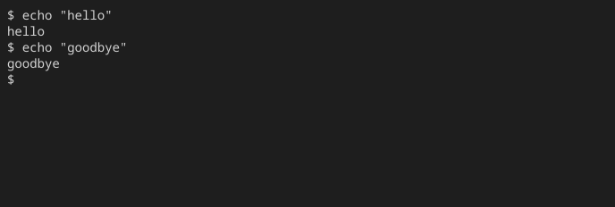

</details>

Then repeat the workflow: press `ctrl+b p` to return to the original window, work on your commands, press `ctrl+b n` to switch to the SVG capture pane, and run the `console2svg` command. This allows you to progressively save the command execution process as SVG images.

Of course, you can also save all lines (useful for evidence). In that case, specify the `-S -` option on the tmux side to capture the entire screen.

```sh
tmux capture-pane -pe -S - -t :0 | console2svg -o full-capture-$(date +%s).svg
```

### Repeat capture mode

use `-m repeat` to repeatedly run a command and capture each result as an animated SVG.
This is useful for commands that output a static snapshot of another terminal, such as `tmux capture-pane`.

Each result is treated as a full-screen update, so content from the previous capture is cleared before the next one is displayed.
The command runs at the interval specified by `--fps` until you stop `console2svg` with `Ctrl+C`.

```sh
console2svg -m repeat --fps 2 -- tmux capture-pane -pe -t :0
```

## Supported platforms

* Windows 10 and later (required `ConPTY`)
* Linux (tested on Ubuntu 24.04, but should work on other distributions as well)
* macOS (ver 0.6.2 and later support macOS(arm64) natively)

## Options
### Major options

* `-o`: Output SVG file path (default: `output.svg`)
* `-c`: Prepend the command line to the output as if typed in a terminal.
* `-w`: width of the output SVG (default: terminal width)
* `-h`: height of the output SVG (default: terminal height)
* `-v`: output to video mode SVG (animated, looped by default)
* `-i`: interactive mode (run a shell in a PTY and capture the current screen on demand)
* `-d`: window chrome style (none, macos, windows, macos-pc, windows-pc, transparent, ...)
* `--background`: background color or image for the output SVG
* `--forecolor`: override default console foreground color
* `--header`: override command header text (shown even without `-c`)
* `--prompt`: override prompt prefix for `-c` (default: `$` or `#` when root)
* `--verbose`: enable verbose logging
* `--crop-*`: crop the output by specified pixels, characters, or text patterns
