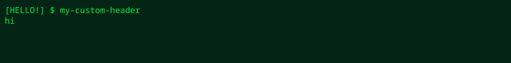

These options fine-tune the detailed layout and displayed content of SVG output.

## SVG text fitting (`--adjust`)

You can control the SVG `lengthAdjust` attribute to reduce character-width differences caused by viewers or font-rendering environments.

* **`spacing`** (default): Adjusts only the spacing between characters. This prevents glyph distortion.
* **`spacingAndGlyphs`**: Also stretches or shrinks the glyph widths themselves so they line up exactly with terminal cells.

```bash
console2svg capture --adjust spacingAndGlyphs -- btop
```

## Header and prompt adjustment

You can customize the command display added by `-c` (`--with-command`).

* **`--prompt <text>`**: Changes the prompt symbol (default: `$` or `#`).
* **`--header <text>`**: Replaces the entire command-line header with the specified string.

```bash
# Change the prompt to ❯
console2svg capture -c --prompt "❯ " -- echo "Hello"

# Replace the entire header with the specified string
console2svg capture --header "user@server:~$ ./build.sh" -- ./build.sh
```

<!-- c2s:: -w 100 -h 4 --prompt "[HELLO!] $" --header "my-custom-header" --forecolor "#00f040" --backcolor "#042515" -- echo "hi" -->

