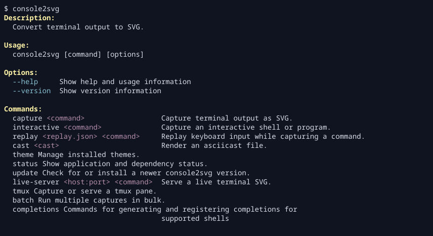

console2svg includes built-in themes that are ready to use. Just pass a theme ID to
`-t` or `--theme` to change the terminal color scheme and window appearance.

## Apply a theme

```bash
console2svg capture -w 100 -h 24 -c --theme nord -- console2svg
```

<!-- c2s:: -w 100 -h 24 -c --theme nord -- console2svg -->


Theme IDs are listed in [Built-in theme overview](./built-in-theme-list.mdx). `theme list` shows both built-in and installed themes together.

```bash
console2svg theme list
console2svg theme list --format markdown
```

`--theme` can also be used with commands that accept themes, such as `replay` and `interactive`, not only with normal capture.

```bash
console2svg replay ./session.json --theme nord -- bash
console2svg interactive --theme cyberpunk-pc -o capture.svg
```

> [!NOTE]
> [Built-in window frames](./built-in-window-themes.mdx) are also defined as part of the theme system.
> Therefore, specifications such as `-t macos` also work.
