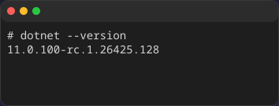
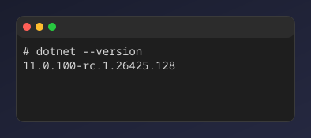
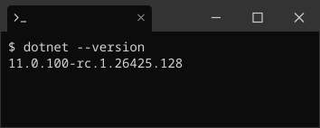
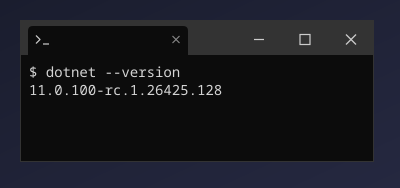
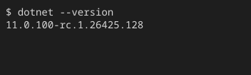

These built-in themes add only a window frame without changing the terminal colors.
Specify one by passing its ID to `-d` or `--window`.

## Window frame list

### `macos`

{/* c2s:: -d macos -w 40 -h 4 -c -- dotnet --version */}

### `macos-pc`

{/* c2s:: -d macos-pc -w 40 -h 4 -c -- dotnet --version */}

### `windows`

{/* c2s:: -d windows -w 40 -h 4 -c -- dotnet --version */}

### `windows-pc`

{/* c2s:: -d windows-pc -w 40 -h 4 -c -- dotnet --version */}

### `none`

{/* c2s:: -d none -w 40 -h 4 -c -- dotnet --version */}

### `transparent`

{/* c2s:: -d transparent -w 40 -h 4 -c -- dotnet --version */}

