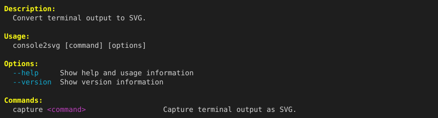

You can directly output capture results as PNG images for platforms and applications that do not support SVG format.

## Output in PNG format

Simply specify `.png` as the extension with the `-o` option, and rasterization is performed automatically.

```bash title="Terminal" "-o output.png"
console2svg capture -o output.png -w 100 -h 12 -- console2svg
```

<!-- c2s:: -w 100 -h 12 -- console2svg -->


## Rendering engines

console2svg includes the built-in [resvg](https://github.com/linebender/resvg) engine (a fast SVG renderer written in Rust), so it can generate high-quality PNG images without installing additional tools.

If needed, you can also switch conversion engines with the `--svg-converter` option.

| Setting | Description |
| :--- | :--- |
| `auto` | Default. Prefer the built-in resvg engine. |
| `resvg` | Force the built-in resvg engine. |
| `rsvg-convert` | Use the system `rsvg-convert` command. |
| `ffmpeg` | Use ffmpeg's librsvg decoder. |

```bash title="Terminal" "--svg-converter rsvg-convert"
console2svg capture -o result.png --svg-converter rsvg-convert -- console2svg
```

<!-- c2s:: -w 100 -h 12 --svg-converter rsvg-convert -- console2svg -->

