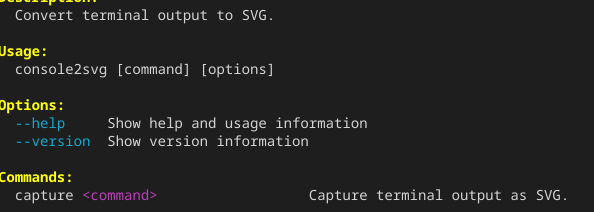
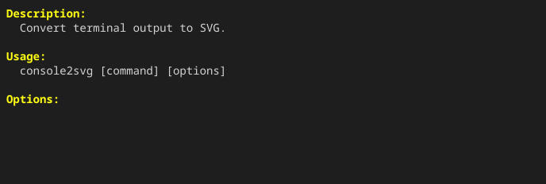
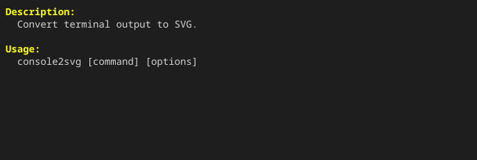

When you want to include only part of a build log or command output in documentation, the crop feature lets you extract only the necessary area and convert it to SVG.

## Crop options

Specify the crop amount for each side with the following options.

| Option | Description |
| :--- | :--- |
| `--crop-top` | Crop the top side |
| `--crop-bottom` | Crop the bottom side |
| `--crop-left` | Crop the left side |
| `--crop-right` | Crop the right side |

## How to specify values

### Pixels (px) or characters (ch)

Specify numeric values directly in pixels (`px`) or character/line counts (`ch`).

```bash title="Terminal" "--crop-top 20px" "--crop-bottom 3ch" "--crop-left 10px" "--crop-right 10ch"
# Before cropping
console2svg capture -w 80 -h 12 -- console2svg

# Crop 20px from the top, 3 lines from the bottom, 10px from the left, and 10 characters from the right
console2svg capture -w 80 -h 12 \ 
  --crop-top 20px --crop-bottom 3ch \
  --crop-left 10px --crop-right 10ch -- console2svg
```

<!-- c2s::  -w 80 -h 12 --crop-top 20px --crop-bottom 3ch --crop-left 10px --crop-right 10ch -- console2svg -->


### Cropping by text pattern

You can also crop dynamically relative to the position where a specific string appears.

```bash title="Terminal" "--crop-bottom"
# Crop everything below the line where the string "Options" appears
console2svg capture -w 80 -h 12 --crop-bottom "Options" -- console2svg
```

<!-- c2s::  -w 80 -h 12 --crop-bottom "Options" -- console2svg -->


By specifying an offset line count, you can crop from lines before or after the matched line.

```bash title="Terminal" "--crop-bottom"
# Keep up to 2 lines (-2) before "Options"
console2svg capture -w 80 -h 12 --crop-bottom "Options::-2" -- console2svg
```

<!-- c2s::  -w 80 -h 12 --crop-bottom "Options::-2" -- console2svg -->

