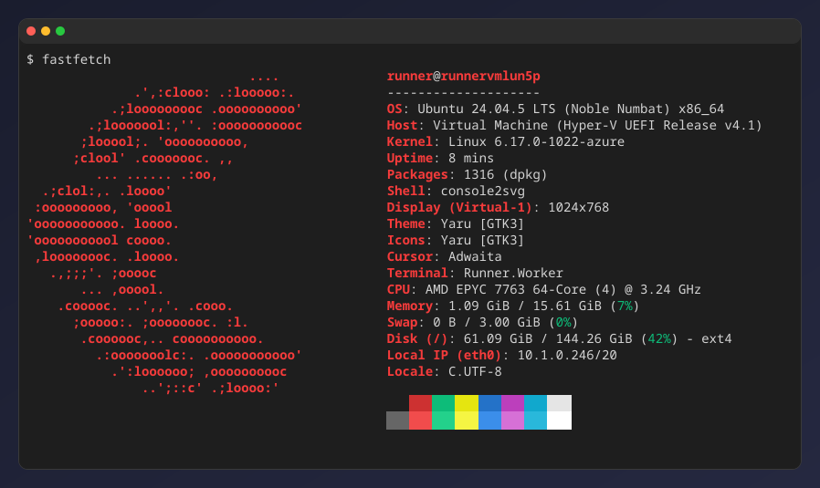
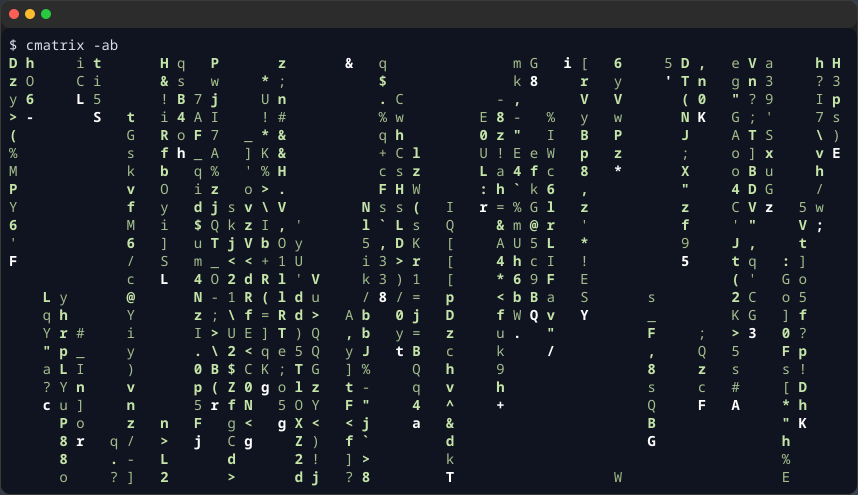
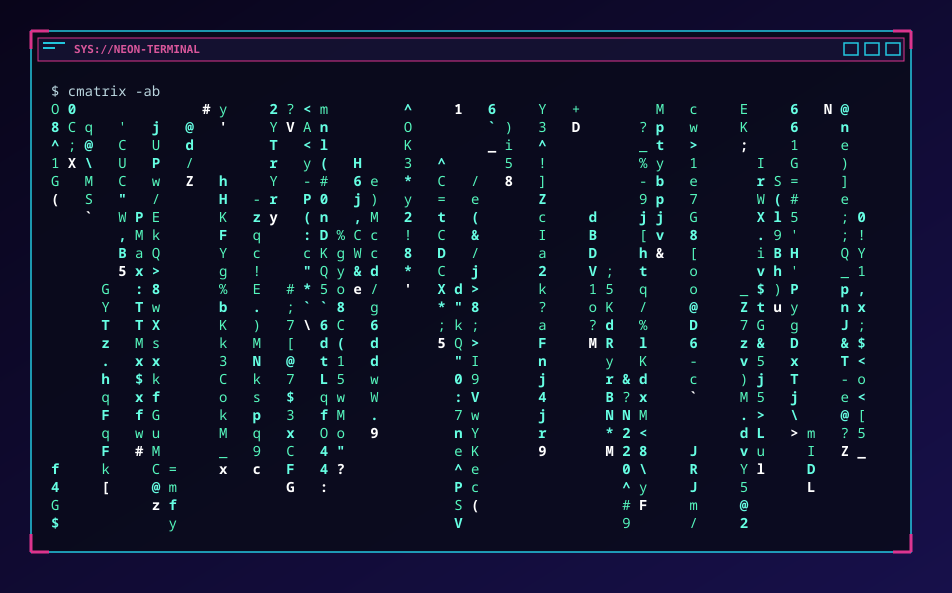
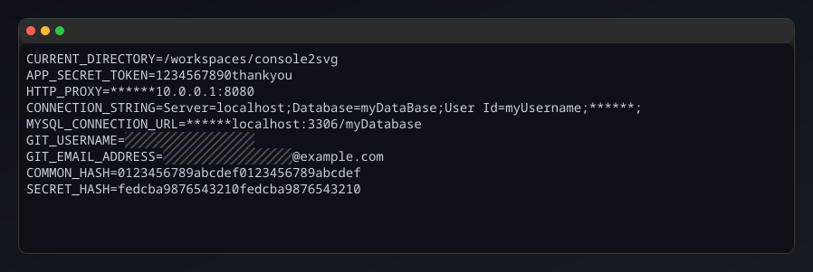

import { Steps } from '@astrojs/starlight/components';

Rather than explaining the features at length in text, it is probably better to show real examples.
This page contains many real usage examples.

> [!TIP]
> Try opening the images in a new tab. You should see that they remain beautiful even when enlarged.

## The simplest example

Let's capture the command's own help text.

```bash
console2svg capture -- console2svg
```

{/* c2s:: -w 120 -- console2svg */}


[Details](/en/basic-usage/capturing-images/overview/)

## With a frame

This uses a macOS Terminal-style frame, specifies the width, and also includes the executed command name.

```bash
console2svg capture -w 100 -c -d macos-pc -- fastfetch
```

{/* c2s:: -w 100 -c -d macos-pc -- fastfetch */}


[Details](/en/appearance/window-and-background/)

## Background and transparency settings

You can make it quite stylish.

```bash
console2svg capture -w 100 -h 10 -c -d macos-pc \
    --background "image1.png" --opacity 0.95 \
    -- oh-my-logo "console2svg" mint --filled --letter-spacing 0
```


[Details](/en/appearance/window-and-background/)

## Animation

### sl

```sh
console2svg capture -c -d -v -- sl
```

{/* c2s:: -w 120 -h 16 -c -d -v -- sl */}


### cmatrix

```sh
console2svg capture -w 100 -h 24 -c -d macos-pc -v --timeout 5 -- cmatrix -ab
```

{/* c2s:: -w 100 -h 24 -c -d macos-pc -v --timeout 5 -- cmatrix -ab */}


### nyancat

```sh
console2svg capture -w 160 -h 28 -c -d -v --timeout 5 --sleep 0.5 -- nyancat
```

{/* c2s:: -w 160 -h 28 -c -d -v --timeout 5 --sleep 0.5 -- nyancat */}


[Details](/en/basic-usage/capturing-videos/overview/)

## Replay playback

By playing back a replay file prepared in advance, you can reproduce the same output even in CI environments.

```sh
console2svg replay ./replay.json -w 80 -h 20 -v -c -d macos -- bash
```

{/* c2s:: -w 80 -h 20 -v -c -d macos --replay ../assets/cmd-bash-vim-replay.json -- bash */}


[Details](/en/automation/replay/)

## Interactive capture

Start recording with the `F9` key, then press `F9` again to stop recording.

```bash
console2svg interactive -d macos -o ./captures/output.svg
```


[Details](/en/basic-usage/interactive-capture/)

## Theme support

Specify any theme you like, whether built-in or custom.

### nord

```bash
console2svg capture -w 100 -h 24 -c -d macos -t nord --timeout 2 -- cmatrix -ab
```

{/* c2s:: -w 100 -h 24 -c -d macos -t nord --timeout 2 -- cmatrix -ab */}


### cyberpunk-pc

```bash
console2svg capture -w 100 -h 24 -c -t cyberpunk-pc --timeout 2 -- cmatrix -ab
```

{/* c2s:: -w 100 -h 24 -c -t cyberpunk-pc --timeout 2 -- cmatrix -ab */}


[Details](/en/appearance/themes/built-in-themes/)

## Sensitive information masking

```bash
cat <<EOF > .env
CURRENT_DIRECTORY=$(pwd)
APP_SECRET_TOKEN=1234567890thankyou
HTTP_PROXY=******10.0.0.1:8080
CONNECTION_STRING=Server=localhost;Database=myDataBase;User Id=myUsername;******;
MYSQL_CONNECTION_URL=******localhost:3306/myDatabase
GIT_USERNAME=hidden_truth_name
GIT_EMAIL_ADDRESS=hidden_truth_name@example.com
COMMON_HASH=$(openssl rand -hex 16)
SECRET_HASH=$(openssl rand -hex 16)
EOF

console2svg capture -w 100 -h 12 -d macos-pc -t github-dark -- cat .env
```

{/* c2s:: -w 100 -h 12 -d macos-pc -t github-dark -- cat ../../.env */}


[Details](/en/basic-usage/masking-secrets/auto-masking/)
