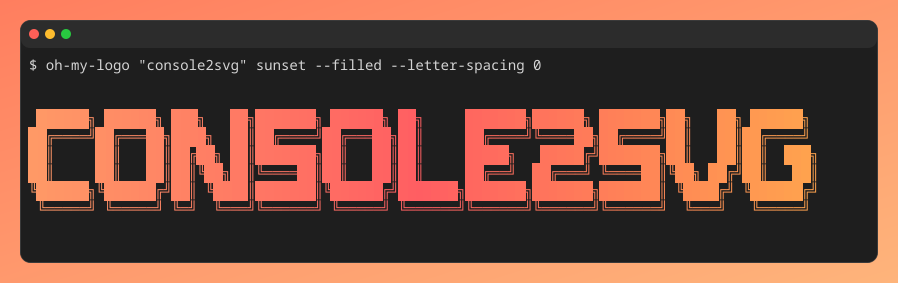

import { Steps } from '@astrojs/starlight/components';

Once you have finished [installing](./installation.mdx) console2svg, let's try it right away.

## Capture a still image
### Simple example

<Steps>

1. Run any command with `console2svg capture -- (any-command)`.

   ```bash
   console2svg capture -- console2svg
   ```

2. That's it. By default, the result is generated as `output.svg`.

3. Open the generated `output.svg` in a browser. You should see output like the following.

   


</Steps>


### Specify options

`capture` accepts several (many) option arguments.
For example, let's display `oh-my-logo` under the following conditions.

* `-o console2svg.svg`: Change the output destination to `console2svg.svg`.
* `-w 100`: Fix the window width (automatic by default).
* `-c`: Add a display of the executed command, such as `$ oh-my-logo ...`, at the beginning of the output.
* `-d macos-pc`: Make it look like a macOS window and add surrounding spacing.
   * If only `-d` is specified, it is treated as `macos` (no surrounding spacing).
* `--background "#ff7e5f" "#feb47b"`: Use a sunset-style gradient background.

```bash
console2svg capture -o console2svg.svg -w 100 -h 10 -c -d macos-pc \
            --background "#ff7e5f" "#feb47b" \
            -- oh-my-logo "console2svg" sunset --filled --letter-spacing 0
```

{/* c2s:: -w 100 -h 10 -c -d macos-pc --background "#ff7e5f" "#feb47b" -- oh-my-logo "console2svg" sunset --filled --letter-spacing 0 */}


For details, see [Capture still images](/en/basic-usage/capturing-images/overview/).


## Capture a video
### Simple example

<Steps>

1. Pass `-v` to the `capture` command and run any command.

   ```bash
   console2svg capture -c -d -v -- sl
   ```

   > [!NOTE]
   > If <code>-v</code> is not specified, the result is a still SVG that draws only the final frame.

2. That's all. The generated result looks like this.

   

</Steps>

### Specify options

For example, let's display `nyancat` under the following conditions.

* `-w 160 -h 32`: Set width to 160 and height to 32.
* `-c`: Add a display of the executed command, such as `$ nyancat`, at the beginning of the output.
* `-d`: Make it look like a macOS window (no surrounding spacing). Equivalent to `-d macos`.
* `-v`: Enable video output.
* `--timeout 5`: Automatically stop after 5 seconds.
* `--sleep 0.5`: Wait 0.5 seconds before looping from the final frame.

```bash
console2svg capture -w 160 -h 32 -c -d -v \
            --timeout 5 --sleep 0.5 -- nyancat -d 10
```


For details, see [Capture videos](/en/basic-usage/capturing-videos/overview/).

## Where to go next

Explore the [capture command reference](/en/reference/cli/capture), learn about [capturing still images](/en/basic-usage/capturing-images/overview/), or try [capturing videos](/en/basic-usage/capturing-videos/overview/). You can also set up [shell completion](/en/utilities/shell-completion) or capture a running pane with the [tmux integration](/en/utilities/tmux).
