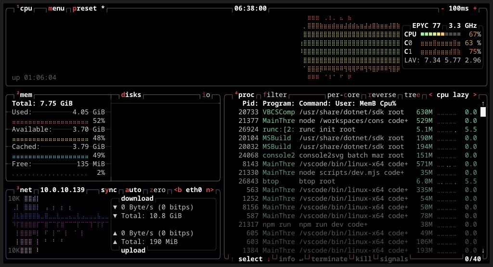
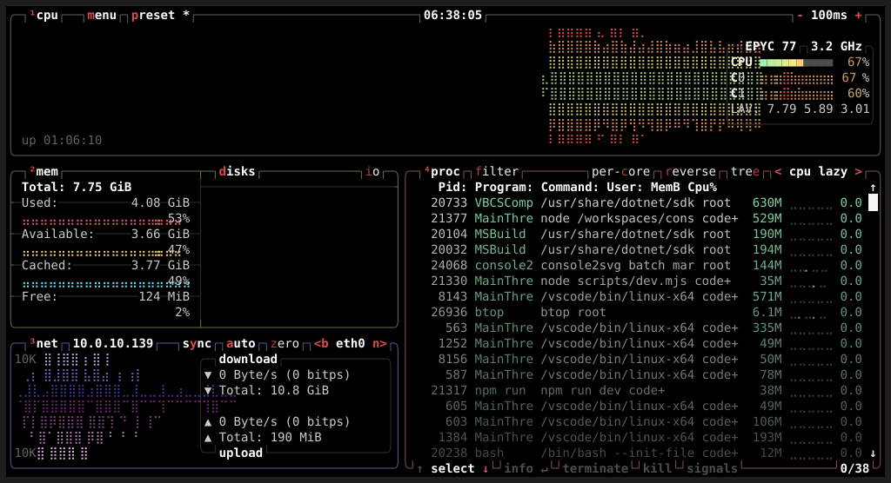

import { FileTree } from '@astrojs/starlight/components';

console2svg saves terminal output as SVG.
SVG is not only for displaying images; it is also a format well suited for sharing text-centered screens such as terminals cleanly and conveniently.

## Sharp at any size

First, compare the following two images.

```bash title="Terminal"
$ btop
```

### SVG
{/* c2s:: -w 120 -h 30 --timeout 5 -- btop */}


### PNG
{/* c2s:: -w 120 -h 30 --timeout 5 -- btop */}



You can see that the former has crisper text and cleaner box-drawing lines.
Because SVG is a vector format, text and lines do not blur when enlarged or reduced. It maintains the same quality even when the display location or size changes, such as in READMEs, blog posts, slides, or printed materials.

## Small file size

If you compare the sizes of the two files above, you can see that the SVG version is overwhelmingly smaller (about one fifth).

<FileTree>

* output.png (195918 bytes)
* output.svg (38912 bytes)

</FileTree>

> [!NOTE]
> Note that this example uses `btop`, which is a relatively **unfavorable** case for SVG.
> Simple text-only cases become even smaller.

## Display directly in the browser

SVG is an open web standard supported by major browsers by default.
Without preparing a special viewer or conversion tool, you can open generated files in a browser or embed them in Markdown or HTML.

```markdown title="README.md"

```
