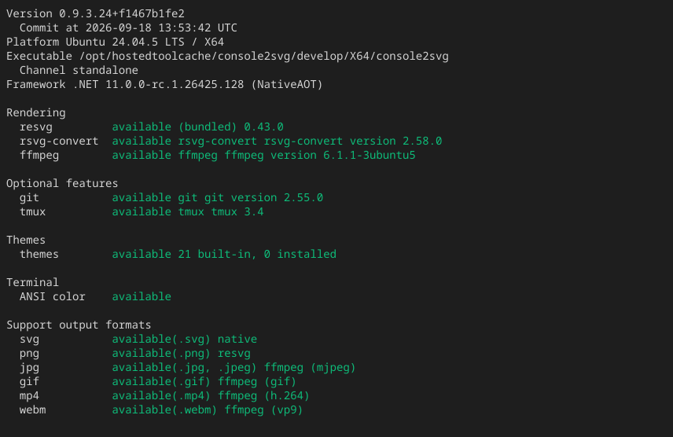

Running the `status` subcommand shows the current version, OS and runtime, SVG renderers, optional features, themes, ANSI colors, and available output formats. External commands are actually started to obtain their versions, so merely being on `PATH` does not make them `available`.

## Usage

```bash title="Terminal"
console2svg status
```

Example output (versions, paths, and availability vary by environment):

<!-- c2s:: -w 100-- console2svg status -->


## Switching output formats

Use `--format` to change the output format.

* `--format table` (default): Terminal table format
* `--format markdown`: Markdown format suitable for pasting into GitHub Issues
* `--format json` (or `--json`): JSON format for scripts

```bash title="Terminal" "--format markdown"
console2svg status --format markdown
```
