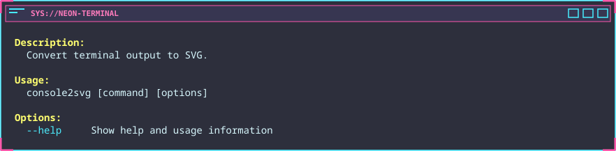
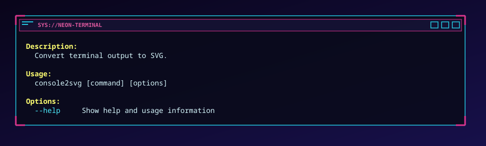

配色とウインドウ枠をまとめて変更する組み込みテーマです。通常表示用と、
デスクトップ風の余白を持つPC表示用のバリエーションがあります。

### `cyberpunk`

{/* c2s::  -w 100 -h 8 -t cyberpunk -- console2svg */}

### `cyberpunk-pc`

{/* c2s::  -w 100 -h 8 -t cyberpunk-pc -- console2svg */}

