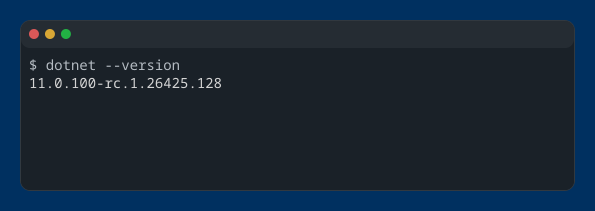
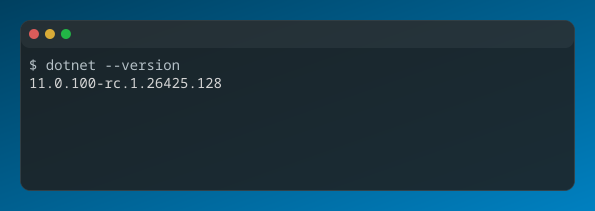
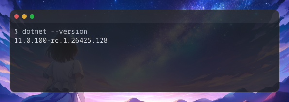

ウインドウの装飾（タイトルバーなど）や背景を設定することで、スクリーンショットの見た目を整えることができます。

## ウインドウ枠スタイル

ウインドウ枠は `-d` または `--window <style>` オプションで指定します。値なしで `-d` のみを指定した場合は `macos` が適用されます。

```bash title="Terminal" "-d macos-pc"
# ドロップシャドウ付きmacOS風スタイル
console2svg capture -d macos-pc -- fastfetch
```

<!-- c2s:: -d macos-pc -- fastfetch -->

### 一覧

組み込みのウインドウ枠と表示例は、[組み込みウインドウ枠](./themes/built-in-window-themes.mdx)
にまとめています。

## 背景の指定

`--background` オプションで背景色や背景画像を設定できます。

### 単色背景

カラーコード（HEX）を指定します。

```bash title="Terminal" "--background"
console2svg capture -h 10 -c -d macos-pc --opacity 0.85 \
  --background "#003060" -- dotnet --version
```

<!-- c2s::  -w 64 -h 6 -c -d macos-pc --background "#003060" --opacity 0.85 -- dotnet --version -->



### グラデーション

複数のカラーコードを指定します。

```bash title="Terminal" "--background"
console2svg capture -h 10 -c -d macos-pc --opacity 0.85 \
  --background "#004060" "#0080c0" -- dotnet --version
```

<!-- c2s::  -w 64 -h 6 -c -d macos-pc --background "#004060" "#0080c0" --opacity 0.85 -- dotnet --version -->



### 画像背景

画像ファイルパスを指定して、デスクトップ背景風に表示できます。

```sh title="Terminal" "--background image.png"
console2svg capture -h 10 -c -d macos-pc --opacity 0.85 \
  --background image.png -- dotnet --version
```

<!-- c2s::  -w 64 -h 6 -c -d macos-pc --background ../../../docs-site/public/assets/image2.png --opacity 0.85 -- dotnet --version -->



## 余白と不透明度

* **`--margin <px>`**: ウインドウ枠の外側のマージン。
* **`--padding <px>`**: ターミナル内側（文字と枠の間）のパディング。
* **`--pc-padding <px>`**: `macos-pc` や `windows-pc` の外側余白サイズ。
* **`--opacity <0.0〜1.0>`**: 背景の不透明度（例: `--opacity 0.9`）。
