import { Steps } from '@astrojs/starlight/components';

TUIツールやプログレスバーの動きを記録したい場合、`-v`（または `--video`）オプションを指定することで、アニメーションSVGを生成できます。

## 基本的な使い方

<Steps>

1. `console2svg capture -v -- (コマンド)` を実行します。

   ```bash title="Terminal" "-v"
   console2svg capture -v -c -d -- sl
   ```

2. 実行内容がアニメーションSVG（`output.svg`）として記録されます。

   {/* c2s:: -c -d -v -- sl */}


</Steps>

## 主なオプション

* **`-v` / `--video`**: アニメーション出力を有効にします。
* **`--fps <number>`**: サンプリングフレームレートを指定します（例: `--fps 30`）。
* **`--sleep <sec>`**: 最終フレームから先頭フレームへループするまでの待機秒数を指定します（例: `--sleep 0.8`）。
* **`--no-loop`**: アニメーションの繰り返し再生を無効にし、1回再生して停止させます。
* **`--fadeout <sec>`**: ループ切り替え時のフェードアウト時間を秒単位で設定します。
* **`--timing <mode>`**: タイミング制御方式を指定します。
  * `deterministic`: イベントのタイミングを正規化して再現性を重視します（CI向け）。
  * `realtime`: 実際の実行時間の通りに記録します。
* **`--timeout <sec>`**: 終了しないコマンドを指定秒数で自動停止させて録画を完了します。

詳細は[`capture`のオプション](../../../reference/cli/capture/)を参照してください。


### 実行例

```sh title="Terminal" "-v" "--timeout 5" "--sleep 0.5"
console2svg capture -w 160 -h 28 -c -d -v --timeout 5 --sleep 0.5 -- nyancat
```

{/* c2s:: -w 160 -h 28 -c -d -v --timeout 5 --sleep 0.5 -- nyancat */}

