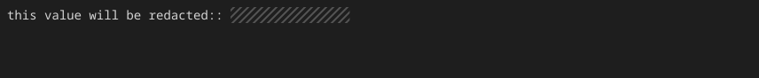

プロジェクト固有のトークンや社内ドメイン名、個人名など、個別に非表示にしたい情報がある場合は `--mask` オプションを使用します。

## 文字列の指定

マスクしたい文字列を `--mask` に渡します。

```bash title="Terminal" "--mask"
console2svg capture --mask "1234567890abcdef" -w 100 -h 12 \
            -- echo "this value will be redacted:: 1234567890abcdef"
```

<!-- c2s:: -w 100 -h 4 --mask 1234567890abcdef -- echo "this value will be redacted:: 1234567890abcdef" -->


## 複数パターンの指定

`--mask` オプションは複数回指定できます。

```bash title="Terminal" "--mask"
console2svg capture \
  --mask "internal-host.local" \
  --mask "admin_password" \
  --mask "user[0-9]+" \
  -- ./check.sh
```

正規表現パターンにも対応しているため、規則的なIDやアカウント名もまとめてマスクできます。
