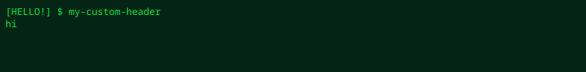

这些选项用于微调 SVG 输出的细节布局和显示内容。

## SVG 文本压缩 (`--adjust`)

你可以控制 SVG 的 `lengthAdjust` 属性，以减少查看器或字体渲染环境造成的字符宽度偏差。

* **`spacing`**（默认）：只调整字符之间的间距，避免字形变形。
* **`spacingAndGlyphs`**：同时拉伸或压缩字符本身的宽度，使其严格对齐终端单元格位置。

```bash title="Terminal" "--adjust spacingAndGlyphs"
console2svg capture --adjust spacingAndGlyphs -- btop
```

## 标头和提示符调整

可以自定义由 `-c`（`--with-command`）添加的命令显示内容。

* **`--prompt <text>`**：更改提示符号（默认：`$` 或 `#`）。
* **`--header <text>`**：将整条执行命令行文本替换为指定字符串。

```bash title="Terminal" "--prompt" "--header"
# 将提示符改为 ❯
console2svg capture -c --prompt "❯ " -- echo "Hello"

# 将整个标头替换为指定字符串
console2svg capture --header "user@server:~$ ./build.sh" -- ./build.sh
```

<!-- c2s::  -w 100 -h 4 --prompt "[HELLO!] $" --header "my-custom-header" --forecolor "#00f040" --backcolor "#042515" -- echo "hi" -->

