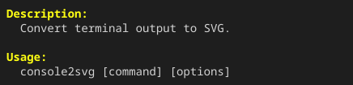

默认情况下，`capture` 的输出尺寸会根据命令或终端使用的宽度和高度决定。
可以使用 `-w` / `--width` 以字符单元指定宽度，使用 `-h` / `--height` 指定高度。

## 固定宽度和高度

```bash title="Terminal" "-w 50 -h 5"
console2svg capture -w 50 -h 5 -- console2svg
```

<!-- c2s::  -w 50 -h 5 -- console2svg -->


此示例会创建横向 50 个字符、纵向 5 行的终端区域。
如果输出命令超出该区域，会像普通终端一样发生换行或滚动。

## 只指定宽度或高度

宽度和高度可以单独指定。未指定的一方会根据常规终端尺寸或命令输出决定。

```bash title="Terminal" "--width 50" "-h 5"
# 只将宽度固定为 50 个字符
console2svg capture --width 50 -- console2svg

# 只将高度固定为 5 行
console2svg capture -h 5 -- console2svg
```
