这些内置主题不会添加窗口边框，只会更改终端配色。

## 调色板列表

### `dark`

{/* c2s::  -w 100 -h 8 -t dark -- console2svg */}
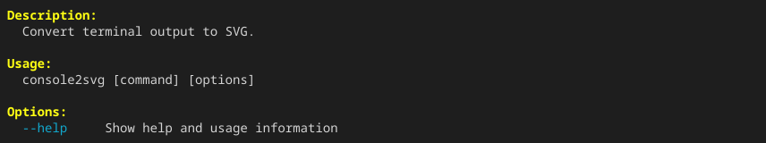

### `light`

{/* c2s::  -w 100 -h 8 -t light -- console2svg */}
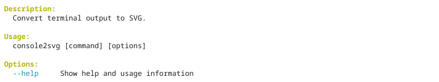

### `github-dark`

{/* c2s::  -w 100 -h 8 -t github-dark -- console2svg */}

### `github-light`

{/* c2s::  -w 100 -h 8 -t github-light -- console2svg */}
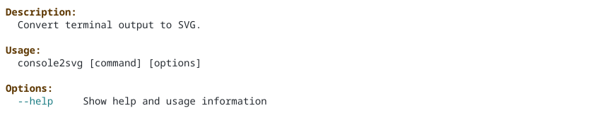

### `dracula`

{/* c2s::  -w 100 -h 8 -t dracula -- console2svg */}
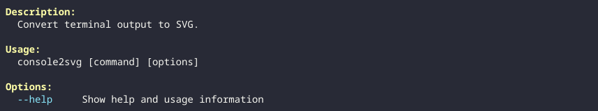

### `gruvbox-dark`

{/* c2s::  -w 100 -h 8 -t gruvbox-dark -- console2svg */}
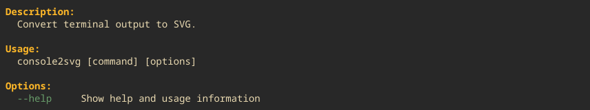

### `gruvbox-light`

{/* c2s::  -w 100 -h 8 -t gruvbox-light -- console2svg */}
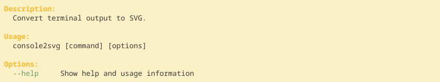

### `one-light`

{/* c2s::  -w 100 -h 8 -t one-light -- console2svg */}
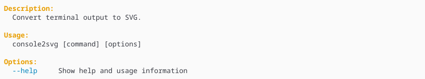

### `nord`

{/* c2s::  -w 100 -h 8 -t nord -- console2svg */}
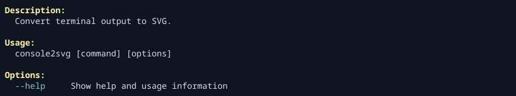

### `solarized-dark`

{/* c2s::  -w 100 -h 8 -t solarized-dark -- console2svg */}
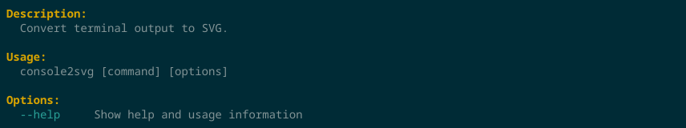

### `solarized-light`

{/* c2s::  -w 100 -h 8 -t solarized-light -- console2svg */}
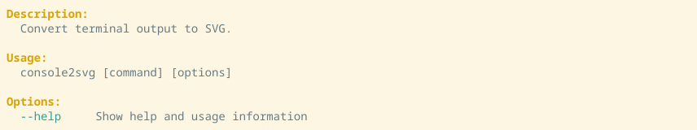

### `tokyo-night`

{/* c2s::  -w 100 -h 8 -t tokyo-night -- console2svg */}
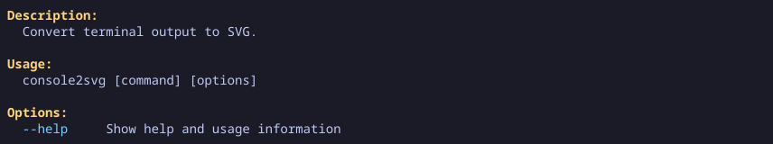

### `matrix`

{/* c2s::  -w 100 -h 8 -t matrix -- console2svg */}

