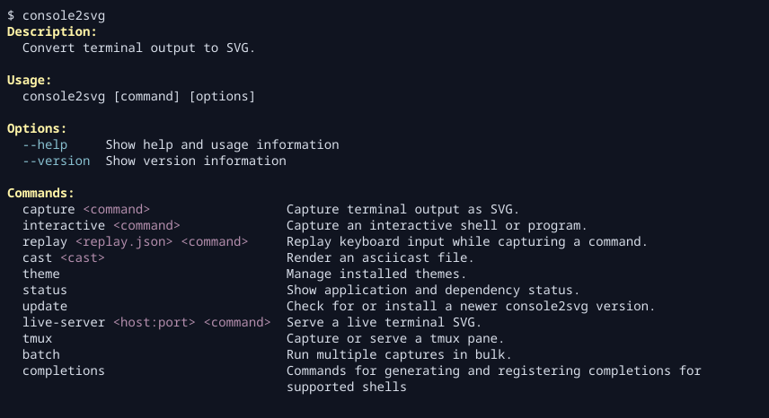

console2svg 包含开箱即用的内置主题。只需将主题 ID 传给
`-t` 或 `--theme`，即可更改终端配色和窗口外观。

## 应用主题

```bash title="Terminal" "-t nord"
console2svg capture -w 100 -h 24 -c -t nord -- console2svg
```

<!-- c2s::  -w 100 -h 24 -c -t nord -- console2svg -->


可以在[内置主题概览](./built-in-theme-list.mdx)中查看主题 ID。`theme list` 会同时显示内置主题和已安装主题。

```bash title="Terminal" "--format markdown"
console2svg theme list
console2svg theme list --format markdown
```

`-t` 不仅可用于普通捕获，也可用于 `replay`、`interactive` 等接受主题的命令。

```bash title="Terminal" "-t nord" "-t cyberpunk-pc"
console2svg replay ./session.json -t nord -- bash
console2svg interactive -t cyberpunk-pc -o capture.svg
```

> [!NOTE]
> [内置窗口边框](./built-in-window-themes.mdx)也作为主题系统的一部分定义。
> 因此，像 `-t macos` 这样的指定方式也可以使用。
