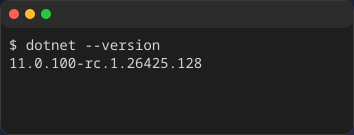
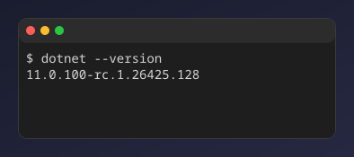
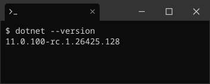
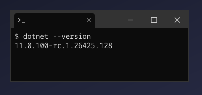
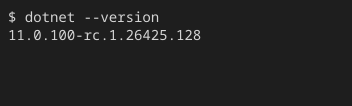

这些内置主题不会更改终端配色，只会添加窗口边框。
请将 ID 传给 `-d` 或 `--window` 来指定。

## 窗口边框列表

### `macos`

{/* c2s::  -d macos -w 40 -h 4 -c -- dotnet --version */}

### `macos-pc`

{/* c2s::  -d macos-pc -w 40 -h 4 -c -- dotnet --version */}

### `windows`

{/* c2s::  -d windows -w 40 -h 4 -c -- dotnet --version */}

### `windows-pc`

{/* c2s::  -d windows-pc -w 40 -h 4 -c -- dotnet --version */}

### `none`

{/* c2s::  -d none -w 40 -h 4 -c -- dotnet --version */}

### `transparent`

{/* c2s::  -d transparent -w 40 -h 4 -c -- dotnet --version */}

