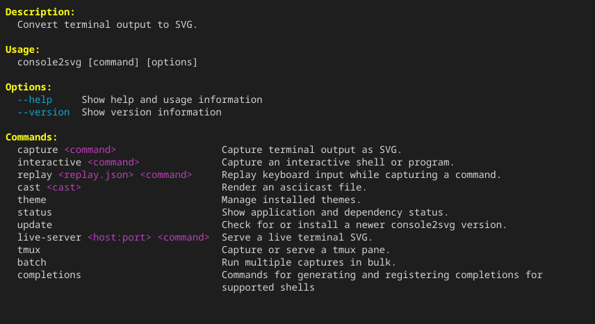
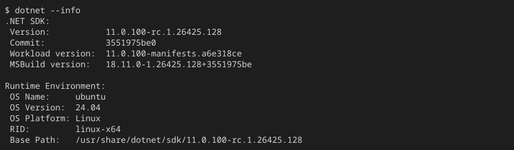

import { Steps } from '@astrojs/starlight/components';

使用 `capture` 子命令，可以将任意 CLI 命令的执行结果保存为矢量格式的 SVG 静态图片。

## 基本用法

<Steps>

1. 执行 `console2svg capture -- (command)`。

   ```bash title="Terminal"
   console2svg capture -- console2svg
   ```

2. 执行命令结束时的画面会作为 `output.svg` 输出。

   {/* c2s:: -- console2svg */}


</Steps>

## 主要选项

静态图片拍摄中常用的选项如下。

* **`-o <path>`**：指定输出文件路径（默认：`output.svg`）。
* **`-c` / `--with-command`**：在输出开头添加类似 `$ console2svg` 的执行命令行。
* **`--prompt <text>`**：更改命令行的提示符号（默认：`$` 或 `#`）。
* **`-w <chars>`**：指定终端宽度（字符数）。
* **`-h <lines>`**：指定终端高度（行数）。
* **`--timeout <sec>`**：经过指定秒数后自动结束命令。用于拍摄不会自行结束的命令。
* **`--frame <index>`**：输出指定帧编号的画面，而不是命令结束时的画面。
* **`--time <sec>`**：输出指定经过秒数时的画面。
* **`--stdout`**：将 SVG 数据写入标准输出，而不是文件。

详情请参阅 [`capture` 选项](../../../reference/cli/capture/)。

### 执行示例

```bash title="Terminal" "-o console2svg.svg -c -w 100 -h 12"
# 输出执行命令，宽度 100 个字符、高度 12 行，并使用自定义文件名
console2svg capture -o console2svg.svg -c -w 100 -h 12 --  dotnet --info
```

{/* c2s::  -c -w 100 -h 12 -- dotnet --info */}

