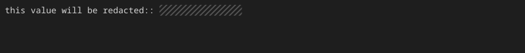

如果有项目专用令牌、内部域名、个人姓名等需要单独隐藏的信息，请使用 `--mask` 选项。

## 指定字符串

将想要遮盖的字符串传给 `--mask`。

```bash title="Terminal" "--mask"
console2svg capture --mask "1234567890abcdef" -w 100 -h 12 \
            -- echo "this value will be redacted:: 1234567890abcdef"
```

<!-- c2s::  -w 100 -h 4 --mask 1234567890abcdef -- echo "this value will be redacted:: 1234567890abcdef" -->


## 指定多个模式

`--mask` 选项可以多次指定。

```bash title="Terminal" "--mask"
console2svg capture \
  --mask "internal-host.local" \
  --mask "admin_password" \
  --mask "user[0-9]+" \
  -- ./check.sh
```

由于也支持正则表达式模式，因此可以一次性遮盖有规律的 ID 或账户名。
